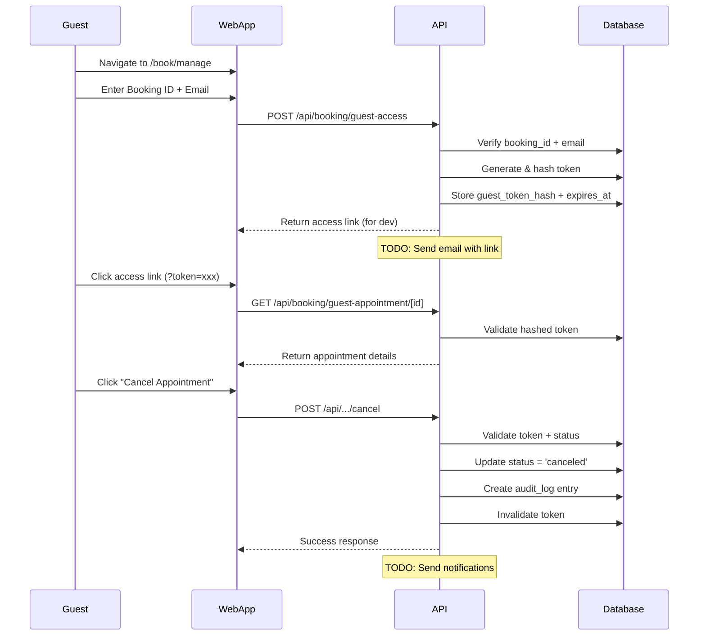

# Step 7q: Guest Booking Management with Booking ID

**Status:** ✅ Complete (with fixes applied)
**Last Updated:** 2025-10-09

## Overview

This document describes the guest booking management system that allows customers without user accounts to view, manage, and cancel their appointments using a unique Booking ID and email verification.

---

## Features

### Core Capabilities

1. **Unique Booking ID Generation**
   - Format: `RHIVO-XXX-XXX-XXX` (e.g., `RHIVO-A3K-9F2-7Q1`)
   - Human-readable, 9-character alphanumeric (uppercase)
   - Automatically generated for all appointments (guest and authenticated)
   - Stored in `appointments.booking_id` column

2. **Guest Access Flow**
   - Guest enters Booking ID + email address
   - System generates secure, short-lived access token (15 minutes)
   - Token is hashed (SHA-256) before storage
   - Access link sent to guest email (TODO: email delivery)
   - Token allows viewing and managing appointment

3. **Secure Token-Based Authentication**
   - SHA-256 hashed tokens stored in `guest_token_hash` column
   - 15-minute expiration window
   - Token remains valid for duration (not invalidated on first view)
   - Invalidated only after cancellation or expiration

4. **Guest Appointment Management**
   - **View:** See appointment details (service, date, time, status)
   - **Cancel:** Cancel confirmed appointments
   - **Audit Trail:** All guest actions logged in `audit_logs` table

---

## Database Schema

### Appointments Table Columns

```sql
-- Booking identification
booking_id TEXT NOT NULL UNIQUE          -- Human-readable booking ID (RHIVO-XXX-XXX-XXX)

-- Guest information
guest_email TEXT                          -- Guest email (required for guest bookings)
guest_phone TEXT                          -- Guest phone (optional)
guest_name TEXT                           -- Guest full name (optional, display purposes)

-- Guest access tokens
guest_token_hash TEXT                     -- SHA-256 hashed access token
guest_token_expires_at TIMESTAMPTZ        -- Token expiration (15 min from generation)

-- Legacy field (deprecated)
cancellation_token TEXT                   -- Old token system, use guest_token_hash instead
```

### Constraints

```sql
-- At least email must be present for guest bookings
CONSTRAINT appointments_contact_check CHECK (
    customer_id IS NOT NULL OR guest_email IS NOT NULL
)

-- Phone is now optional (not required for guest access)
```

### Indexes

```sql
CREATE UNIQUE INDEX appointments_booking_id_idx ON appointments(booking_id);
CREATE INDEX appointments_guest_token_hash_idx ON appointments(guest_token_hash)
  WHERE guest_token_hash IS NOT NULL;
```

---

## API Endpoints

### 1. Request Guest Access

**Endpoint:** `POST /api/booking/guest-access`

**Purpose:** Generates a secure access token and sends access link to guest email.

**Request Body:**
```json
{
  "bookingId": "RHIVO-A3K-9F2-7Q1",
  "email": "guest@example.com"
}
```

**Response (Success):**
```json
{
  "success": true,
  "message": "Guest access link generated for debugging.",
  "manageUrl": "https://rhivo.app/book/manage/RHIVO-A3K-9F2-7Q1?token=abc123..."
}
```

**Security Features:**
- Case-insensitive email comparison
- Generic response to prevent user enumeration
- Token hashed (SHA-256) before storage
- 15-minute expiration window
- TODO: Email delivery via transactional email service

**Rate Limiting:** TODO - Add rate limiting to prevent abuse

---

### 2. Get Appointment Details

**Endpoint:** `GET /api/booking/guest-appointment/[booking_id]?token={token}`

**Purpose:** Retrieves appointment details for authenticated guest.

**Query Parameters:**
- `token` (required): Access token from email link

**Response (Success):**
```json
{
  "success": true,
  "appointment": {
    "id": "uuid",
    "bookingId": "RHIVO-A3K-9F2-7Q1",
    "serviceName": "Swedish Massage",
    "startTime": "2025-10-15T10:00:00Z",
    "endTime": "2025-10-15T11:00:00Z",
    "customerName": "John Doe",
    "guestEmail": "guest@example.com",
    "status": "confirmed"
  }
}
```

**Security:**
- Token is hashed and compared with stored hash
- Expiration check enforced
- Token remains valid for 15 minutes (not invalidated on GET)

**Error Responses:**
- `401`: Invalid or expired token
- `404`: Appointment not found

---

### 3. Cancel Appointment

**Endpoint:** `POST /api/booking/guest-appointment/[booking_id]/cancel`

**Purpose:** Cancels a confirmed appointment.

**Request Body:**
```json
{
  "token": "abc123..."
}
```

**Response (Success):**
```json
{
  "success": true
}
```

**Actions Performed:**
1. Validates token (hash + expiration)
2. Checks appointment status (must be `confirmed`)
3. Updates status to `canceled`
4. Invalidates guest token (sets `guest_token_hash` to NULL)
5. Creates audit log entry with `canceled_by: 'guest'`
6. TODO: Notify business owner
7. TODO: Send confirmation email to guest

**Error Responses:**
- `400`: Appointment cannot be canceled (already canceled/completed)
- `401`: Invalid or expired token
- `404`: Appointment not found

---

## User Flows

### Guest Booking Management Flow



---

## Implementation Details

### Booking ID Generation

**File:** `src/lib/booking/id.ts`

```typescript
import { customAlphabet } from 'nanoid';

const alphabet = 'ABCDEFGHIJKLMNOPQRSTUVWXYZ0123456789';
const nanoid = customAlphabet(alphabet, 9);

export function generateBookingId(): string {
  const id = nanoid();
  return `RHIVO-${id.substring(0, 3)}-${id.substring(3, 6)}-${id.substring(6, 9)}`;
}
```

**Properties:**
- Uses `nanoid` for collision-resistant IDs
- 36^9 ≈ 101 trillion possible IDs
- Human-readable format with dashes
- Uppercase only for easier communication

---

### Token Security

**Hashing Algorithm:** SHA-256 (crypto.createHash)

```typescript
import { createHash } from 'crypto';

// Generate token
const token = randomBytes(32).toString('hex'); // 64 characters

// Hash before storage
const tokenHash = createHash('sha256').update(token).digest('hex');

// Store in database
await db`
  UPDATE appointments
  SET guest_token_hash = ${tokenHash},
      guest_token_expires_at = ${expiresAt}
  WHERE id = ${appointmentId}
`;
```

**Why SHA-256 instead of bcrypt?**
- Tokens are short-lived (15 min) and single-use
- SHA-256 is faster and sufficient for this use case
- Tokens have high entropy (32 random bytes)
- No need for adaptive hashing for temporary tokens

---

### Audit Logging

All guest actions are logged in `audit_logs` table:

```typescript
await db`
  INSERT INTO audit_logs (
    id,
    appointment_id,
    actor_id,              // NULL for guest actions
    action,                // 'canceled'
    old_state,
    new_state,
    timestamp
  ) VALUES (
    ${uuidv4()},
    ${appointmentId},
    NULL,                  // Guest has no user ID
    'canceled',
    ${JSON.stringify({ status: 'confirmed', guest_email: 'guest@example.com' })},
    ${JSON.stringify({ status: 'canceled', canceled_by: 'guest', guest_email: 'guest@example.com' })},
    NOW()
  )
`;
```

**Audit Trail Contents:**
- `actor_id = NULL` indicates guest action
- `new_state` includes `canceled_by: 'guest'` for clarity
- Timestamp captures exact cancellation time
- Full state captured for business reporting

---

## Frontend Pages

### Manage Booking Landing Page

**Path:** `/app/book/manage/page.tsx`

**Features:**
- Form with Booking ID + email inputs
- Booking ID auto-converts to uppercase
- Email format validation
- Generic success message to prevent user enumeration
- Redirect to appointment page on successful access

**UI Components:**
- Teal gradient button
- Clean, minimal form design
- Error/success message display
- Responsive layout

---

### Appointment Management Page

**Path:** `/app/book/manage/[booking_id]/page.tsx`

**Features:**
- Displays appointment details (service, date, time, status)
- Cancel button (only for `confirmed` status)
- Reschedule button (TODO: not yet implemented)
- Loading states and error handling
- Token extracted from URL query params

**UI Elements:**
- Large booking ID display at top
- Service name and date/time in card layout
- Status badge (colored by status)
- Action buttons (cancel, reschedule)
- Confirmation dialogs for destructive actions

---

## Security Considerations

### Token Security
- ✅ Tokens hashed (SHA-256) before storage
- ✅ 15-minute expiration enforced
- ✅ Tokens invalidated after use (cancel action)
- ✅ High-entropy tokens (32 random bytes)
- ⚠️ TODO: Rate limiting on guest-access endpoint

### Email Verification
- ✅ Case-insensitive email comparison
- ✅ Generic responses to prevent user enumeration
- ⚠️ TODO: Actual email delivery (currently console.log)

### User Enumeration Prevention
- ✅ Same response for valid/invalid booking ID
- ✅ Same response for valid/invalid email
- ✅ No hints about which field is wrong

### CSRF Protection
- ✅ Next.js default CSRF protection for API routes
- ✅ Token must be present in URL (not cookies)

---

## Migration History

| Migration | Description | Status |
|-----------|-------------|--------|
| 015_guest_booking_management.sql | Added `booking_id`, `guest_token`, `guest_token_expires_at` | ✅ Applied |
| 016_add_guest_name_to_appointments.sql | Added `guest_name` column | ✅ Applied |
| 017_fix_guest_booking_schema.sql | Renamed to `guest_token_hash`, fixed constraints | 🆕 Ready to apply |

---

## TODO List

### High Priority
1. **Email Delivery** - Implement transactional email service
   - Send access links to guests
   - Send cancellation confirmations
   - Send booking confirmations with Booking ID

2. **Rate Limiting** - Protect guest-access endpoint
   - Limit by IP address
   - Limit by email address
   - Use existing `rate_limits` table

3. **Notification System** - Business owner notifications
   - Email on guest cancellation
   - SMS option (if configured)
   - Dashboard notification badge

### Medium Priority
4. **Reschedule Functionality** - Allow guests to reschedule
   - Similar flow to cancel
   - Show available time slots
   - Validate capacity
   - Create audit log entry

5. **Booking Confirmation Page** - Display Booking ID
   - Show after successful booking
   - Prominently display Booking ID
   - Explain how to manage booking
   - Option to email confirmation

6. **Guest Name Collection** - Improve UX
   - Add name field to booking form
   - Store in `guest_name` column
   - Display on appointment details

### Low Priority
7. **Multi-language Support** - Translate guest pages
8. **SMS Access Links** - Alternative to email
9. **Booking ID Search** - For business owners

---

## Testing Checklist

### Manual Testing

- [ ] Generate booking with guest email (no customer_id)
- [ ] Verify Booking ID format matches `RHIVO-XXX-XXX-XXX`
- [ ] Request access link with valid Booking ID + email
- [ ] Request access link with invalid Booking ID (should still succeed)
- [ ] Request access link with wrong email (should still succeed)
- [ ] Click access link with valid token
- [ ] Verify appointment details displayed correctly
- [ ] Click access link again (should still work - not invalidated)
- [ ] Wait 16 minutes and try access link (should fail - expired)
- [ ] Cancel appointment with valid token
- [ ] Verify status changed to 'canceled' in database
- [ ] Verify audit_log entry created with `canceled_by: 'guest'`
- [ ] Try to cancel already-canceled appointment (should fail)
- [ ] Try to use token after cancellation (should fail - invalidated)

### Automated Testing

```typescript
// TODO: Write integration tests
describe('Guest Booking Management', () => {
  it('generates unique booking ID for new appointments', async () => {});
  it('creates access token when valid booking ID + email provided', async () => {});
  it('hashes token before storing in database', async () => {});
  it('rejects expired tokens', async () => {});
  it('allows viewing appointment with valid token', async () => {});
  it('does not invalidate token on first GET request', async () => {});
  it('cancels appointment and invalidates token', async () => {});
  it('creates audit log entry for guest cancellation', async () => {});
  it('prevents user enumeration via consistent responses', async () => {});
});
```

---

## Deployment Notes

### Database Migration

Run migrations in order:
```bash
# If migrations 015 and 016 already applied:
psql $DATABASE_URL -f src/db/migrations/017_fix_guest_booking_schema.sql

# Verify column exists:
psql $DATABASE_URL -c "\d appointments" | grep guest_token_hash
```

### Configuration

No environment variables needed. Booking ID generation is automatic.

### Monitoring

Key metrics to track:
- Guest access requests per day
- Token expiration rate (should be low)
- Guest cancellation rate
- Failed token validation attempts (security metric)

---

## Acceptance Criteria

✅ **Complete:**
- [x] Booking ID generated for all appointments
- [x] Booking ID format is `RHIVO-XXX-XXX-XXX`
- [x] Guest can request access using Booking ID + email
- [x] Tokens are hashed before storage (SHA-256)
- [x] Tokens expire after 15 minutes
- [x] Guest can view appointment details with valid token
- [x] Token remains valid for duration (not one-time use)
- [x] Guest can cancel confirmed appointments
- [x] Cancellation creates audit log entry
- [x] Token invalidated after cancellation
- [x] User enumeration prevented (generic responses)
- [x] Database schema supports guest phone as optional
- [x] Guest name field added to appointments

⚠️ **Incomplete (TODO):**
- [ ] Email delivery for access links
- [ ] Email delivery for cancellation confirmations
- [ ] Booking confirmation page displays Booking ID
- [ ] Business owner notification on guest cancellation
- [ ] Rate limiting on guest-access endpoint
- [ ] Reschedule functionality for guests
- [ ] Integration tests for guest flows

---

**References:**
- Prompt.xml Step 7q (lines 445-457)
- DATABASE_SCHEMA.md (appointments table)
- AUTH_IMPLEMENTATION.md (token patterns)
